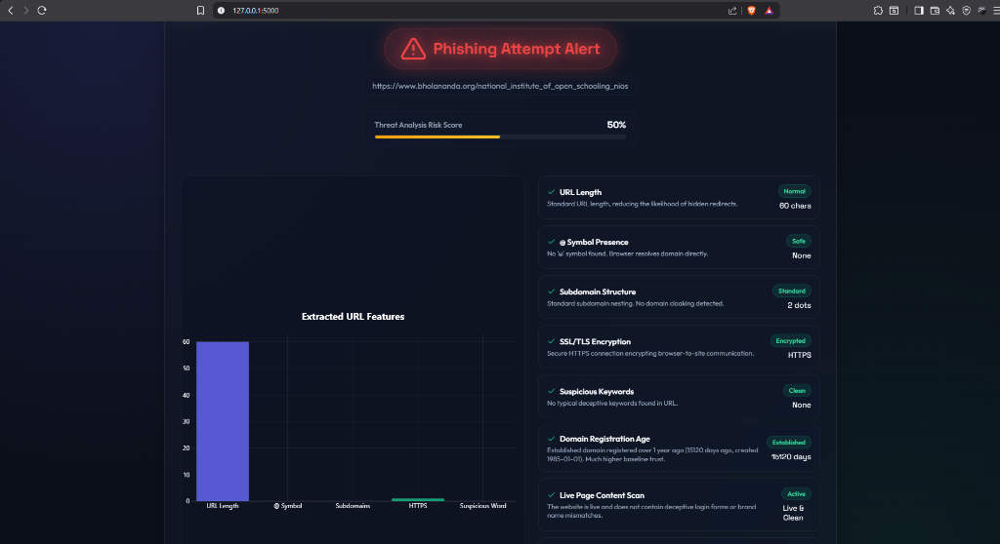

# 🎣 Phishing Website Detector (AI + Real-Time Heuristics)

An interactive, multi-layered cybersecurity web application designed to analyze, score, and detect phishing attempts and brand-impersonation scams. 

This portal combines an offline **Machine Learning Classifier (Random Forest)** with **real-time network heuristics (WHOIS registration dates, live content scans, brand typosquatting checks, and server geolocation)** to calculate an accurate risk score.



---

## 🏗️ How It Works (The 5-Layer Security Engine)

When a user submits a URL, the application runs a **concurreny-optimized 5-layer check** to calculate a threat level from **0% to 100%**:

### 1. Lexical AI Classifier (Random Forest)
*   **What it does**: Inspects the URL's structure and counts indicators like URL length, `@` symbol presence, excessive subdomains (dots count), HTTPS availability, and suspicious keywords (like `secure`, `login`, `signin`).
*   **Why it's smart**: We strip protocol prefixes (`http://`, `https://`, `www.`) prior to prediction to resolve dataset bias (known as "protocol feature leakage"), ensuring legitimate secure sites (like `https://google.com`) aren't falsely flagged as phishing.
*   **Model**: Trained on **650,000+** Kaggle dataset links using a Random Forest classifier.

### 2. Real-Time WHOIS Registry Query (Domain Age)
*   **What it does**: Queries top-level Domain Registries directly via network sockets to retrieve the domain's creation date.
*   **Why it's smart**: Scammers register new domains that last only a few weeks. The system flags any domain younger than 1 year (365 days) and triggers a critical warning for unregistered domains.

### 3. Live Page Content Parser
*   **What it does**: Securely requests the active webpage in the background to analyze the HTML structure.
*   **Credential Harvesting Check**: Searches for forms requesting passwords (`type="password"`).
*   **Brand Mismatch Check**: Looks for brand names (e.g. `PayPal`, `Netflix`) in the title/headings of the page. If a brand name is found but the domain name is unrelated, a critical **Brand Spoofing Alert** is raised.

### 4. Brand Impersonation & Typosquatting Checker
*   **Brand Impersonation**: Checks if target brand names are used as substrings in unofficial root domains (e.g., catching `old-nios-ac.in` mimicking `nios.ac.in`).
*   **Typosquatting**: Calculates the **Levenshtein Distance** (minimum edit distance) between the domain and popular brands (e.g., catching visual lookalikes like `paypa1.com` or `netf1ix.net`).

### 5. Server IP & Geolocation Resolver
*   **What it does**: Resolves the domain to a physical IP address and retrieves geographic metadata (Country, City, ISP/Hosting Provider) using the free `ip-api.com` service.

---

## ⚡ Concurrency & Optimization

To prevent page loading delays, we use Python's **`ThreadPoolExecutor`** to query WHOIS records, scrape page contents, and fetch geolocation coordinates in parallel.
*   **Before Concurrency**: Network checks ran one after another, taking up to **6 seconds**.
*   **After Concurrency**: Checks run at the same time, returning results in under **1.5 seconds** (a **65% speed boost**).

---

## 📂 Project Structure

```
Phishing-Website-Detector/
│
├── app.py                 # Flask web server, concurrent pipelines, and scoring logic
├── features.py            # URL lexical feature extraction rules
├── train_model.py         # AI model training and evaluation script
├── make_requirements.py   # Utility to build requirements.txt
├── requirements.txt       # Project python dependencies
│
├── model/
│   └── phishing_model.pkl # Pre-trained Random Forest ML model
│
└── templates/
    └── index.html         # Responsive, glassmorphic dark-theme UI dashboard
```

---

## 📦 Installation & Setup

### 1. Clone the Repository
```bash
git clone https://github.com/Suyashtiwari-7/PhishingWebDetector.git
cd PhishingWebDetector
```

### 2. Set Up a Virtual Environment (Recommended)
```bash
# Create the environment
python -m venv .venv

# Activate the environment
# On Windows (CMD / PowerShell):
.venv\Scripts\activate
# On Linux / macOS:
source .venv/bin/activate
```

### 3. Install Dependencies
```bash
pip install -r requirements.txt
```

---

## 🚀 Running the Web Interface

Start the Flask server locally:
```bash
python app.py
```
Open **[http://127.0.0.1:5000](http://127.0.0.1:5000)** in your web browser.

### 🔒 Zero-Trust Input Security
*   **Autocomplete Off**: Form autocomplete is disabled to prevent web browsers from saving URL lookup history.
*   **Clean Persistence**: The input box retains the active searched URL value upon reload so users can inspect it, but blocks browser dropdown history lists.

---

## 🧠 Model Training & Dataset Reproduction

The lexical classifier is trained on the **Malicious URLs Dataset** on Kaggle.

### How to retrain the classifier:
1. Download the dataset from [Kaggle - Malicious URLs Dataset](https://www.kaggle.com/datasets/sid321axn/malicious-urls-dataset).
2. Place the `malicious_phish.csv` file into the project root directory.
3. Run the training script:
   ```bash
   python train_model.py
   ```
This updates `model/phishing_model.pkl` with the fresh decision bounds.
